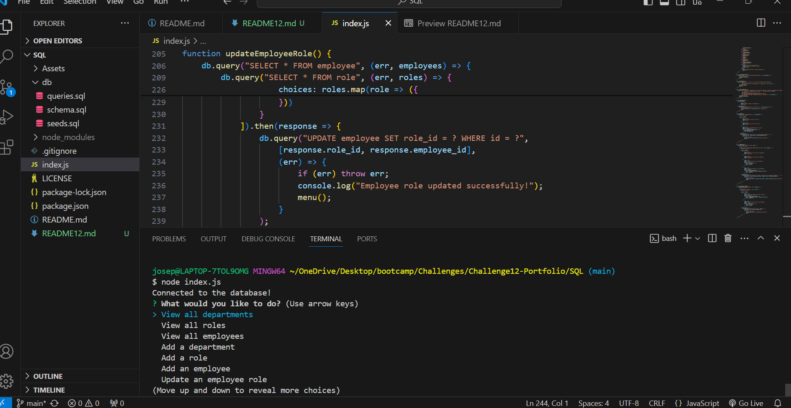

# SQL: Employee Tracker

## Description

### What was your motivation?
- My motivation for developing this command-line application was to create a user-friendly interface for business owners to efficiently manage their company's employee database.

### Why did you build this project?
- I built this project to address the common need among businesses to have a streamlined system for handling employee data. By leveraging Node.js, Inquirer, and PostgreSQL, I aimed to create a robust and intuitive application that enables users to perform essential tasks such as viewing, adding, and updating employee-related information seamlessly.

### What problem does it solve?
- This project solves the problem of manual and cumbersome management of employee data in a company. By providing a command-line interface with options to view, add, and update departments, roles, and employees, it offers a convenient and efficient solution for business owners to organize their workforce data effectively.

### What did you learn?
- Through this project, I gained hands-on experience in building command-line applications using Node.js and interacting with databases like PostgreSQL. I learned how to integrate user input functionalities using Inquirer and manage database operations such as querying, inserting, and updating data. 

## Installation

- 1. Navigate to the project directory.
- 2. Install `npm install`.
- 3. Once npm are installed and the database is set up, run the application using the following command `node index.js`.
- 4. Follow the prompts and select the desired options (e.g., view all departments, add a role, update an employee role, etc.) to interact with the application and manage the company's employee database.

## Usage

## License

MIT License

Copyright (c) 2024 Joseph Daza

Permission is hereby granted, free of charge, to any person obtaining a copy
of this software and associated documentation files (the "Software"), to deal
in the Software without restriction, including without limitation the rights
to use, copy, modify, merge, publish, distribute, sublicense, and/or sell
copies of the Software, and to permit persons to whom the Software is
furnished to do so, subject to the following conditions:

The above copyright notice and this permission notice shall be included in all
copies or substantial portions of the Software.

THE SOFTWARE IS PROVIDED "AS IS", WITHOUT WARRANTY OF ANY KIND, EXPRESS OR
IMPLIED, INCLUDING BUT NOT LIMITED TO THE WARRANTIES OF MERCHANTABILITY,
FITNESS FOR A PARTICULAR PURPOSE AND NONINFRINGEMENT. IN NO EVENT SHALL THE
AUTHORS OR COPYRIGHT HOLDERS BE LIABLE FOR ANY CLAIM, DAMAGES OR OTHER
LIABILITY, WHETHER IN AN ACTION OF CONTRACT, TORT OR OTHERWISE, ARISING FROM,
OUT OF OR IN CONNECTION WITH THE SOFTWARE OR THE USE OR OTHER DEALINGS IN THE
SOFTWARE.
